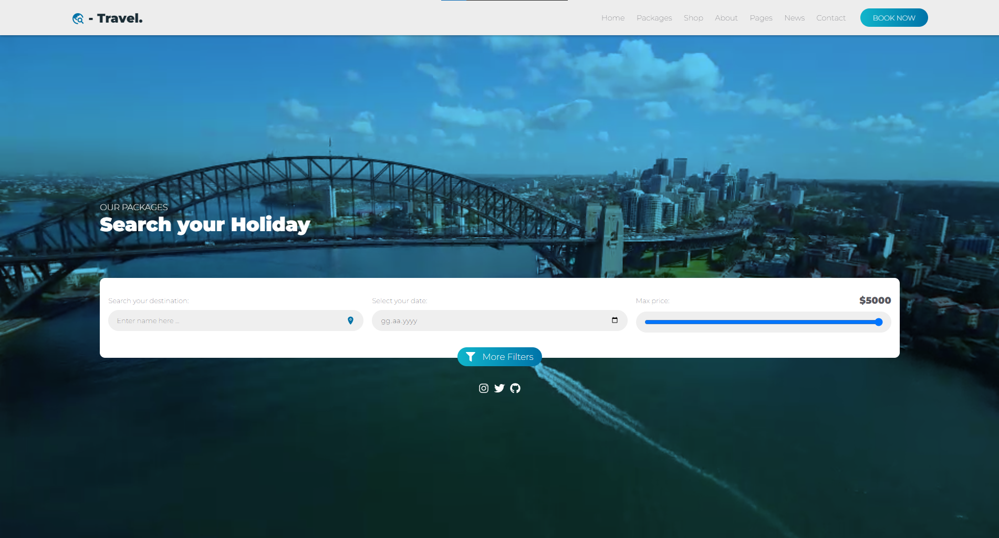
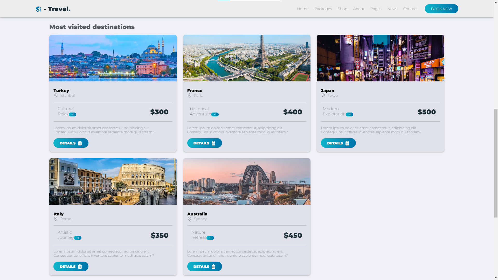
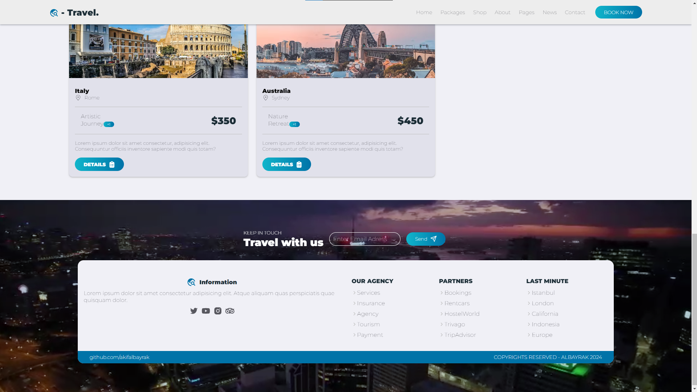

# Travel Website

This is a React-based travel website project that showcases various travel destinations and allows users to search for holiday packages.

## Description

This project is a travel website built using React. It includes the following components:
- Navbar: Navigation bar component with a responsive menu.
- Home: Homepage component with a video background and search functionality.
- Main: Component displaying popular travel destinations.
- Footer: Footer component with contact form and social media links.

## Installation

1. Clone the repository:

```
git clone https://github.com/akifalbayrak/travel-website.git
```

2. Navigate into the project directory:

```
cd travel-website
```

3. Install dependencies:

```
npm install
```

## Usage

To start the development server:

```
npm start
```

Open [http://localhost:3000](http://localhost:3000) to view it in the browser.

## Contributing

Contributions are welcome! If you find any issues or have suggestions for improvement, please open an issue or submit a pull request.




